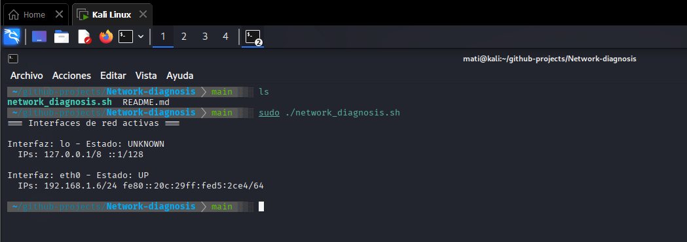

# 🌐 Console-Based Network Diagnosis – Active Interfaces  
### (Diagnóstico de Red por Consola – Interfaces Activas)

---

## 🧩 Overview / Descripción  
**EN:**  
Bash script to list all active network interfaces with their assigned IP addresses on Linux systems.  
Useful for quick network diagnostics, server audits, or connectivity verification.  

**ES:**  
Script en Bash para listar todas las interfaces de red activas con sus direcciones IP asignadas en sistemas Linux.  
Útil para diagnósticos rápidos de red, auditorías de servidores o verificación de conectividad.

---
## ✅ Prerequisites / Prerrequisitos  

- Linux (tested on Ubuntu 22.04, CentOS 8)  
- Bash shell  
- `ip` command (usually included)  
- Execution permissions

## ▶️ Usage / Uso  
**EN:**  
Run the script with execution permissions:  

chmod +x network_diagnosis.sh
./network_diagnosis.sh

**ES:**
Ejecuta el script con permisos de ejecución:

chmod +x network_diagnosis.sh
./network_diagnosis.sh

🛠️ Commands Used / Comandos Utilizados

| Command | Description (EN)                             | Descripción (ES)                                          |
| ------- | -------------------------------------------- | --------------------------------------------------------- |
| `ip`    | Displays network interfaces and IP addresses | Muestra las interfaces de red y sus direcciones IP        |
| `awk`   | Text processing to extract relevant info     | Procesamiento de texto para extraer información relevante |
| `bash`  | Script execution and automation logic        | Ejecución del script y lógica de automatización           |

📂 Output Example / Ejemplo de Salida

**EN:**
Displays the list of active interfaces with assigned IP addresses.

Interface: eth0   →  IP: 192.168.1.10

Interface: wlan0  →  IP: 192.168.1.5

**ES:**
Muestra el listado de interfaces activas con sus direcciones IP asignadas.

Interfaz: eth0   →  IP: 192.168.1.10

Interfaz: wlan0  →  IP: 192.168.1.5

## 🖼️ Screenshot / Captura de Ejecución  

**EN:**  
Below is an example of the script running on Kali Linux, displaying the active network interfaces.  

**ES:**  
A continuación se muestra un ejemplo del script ejecutándose en Kali Linux, mostrando las interfaces de red activas.  

  

📘 Notes / Notas

**EN:**
This tool is part of my Linux Automation & Network Toolkit series.

**ES:**
Esta herramienta forma parte de mi serie de automatización y diagnóstico de red en Linux.

---
🧑‍💻 Developed by [Matías Lagos Barra](https://github.com/Matiaslb14) — Linux & Cloud Security Enthusiast.
